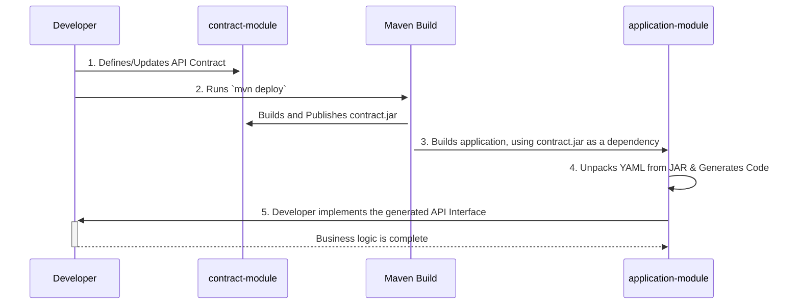

# Dummy Insurance API

A well-architected dummy project simulating the backend services for an insurance company. This
project is developed using Spring Boot and follows modern API development best practices.

> **Note on Diagrams:** This README contains diagrams created with Mermaid.js. For the best viewing
> experience, please use a Markdown viewer or a browser extension (like the "Mermaid Markdown Syntax
> Highlighting" for Chrome/Edge) that supports Mermaid rendering. GitHub renders these diagrams
> automatically.

## About The Project

This project is a sample backend application designed to emulate the architecture and best practices
found in real-world microservices, while intentionally remaining less complex for educational
purposes.

Its primary purpose is to serve as a realistic and stable **baseline for tutorials, blog posts, and
other technical demonstrations**. For example, it can be used to showcase advanced concepts like
integrating an AI service, setting up a CI/CD pipeline, or implementing security patterns on a
pre-existing, well-structured application.

The **insurance domain** was deliberately chosen because it involves a rich set of interacting
actors (customers, employees with various roles, agents, etc.) and related entities (policies,
claims). This makes it an ideal sandbox for simulating a variety of real-world business scenarios in
future content.

---

## Technologies Used

* **Framework**: Spring Boot 3.5.4
* **Language**: Java 21 LTS
* **Build Tool**: Maven
* **Database**: H2 In-Memory Database
* **API Specification**: OpenAPI 3 (with Springdoc)
* **Data Persistence**: Spring Data JPA / Hibernate
* **Mapping**: MapStruct
* **Boilerplate Reduction**: Lombok
* **Testing**: JUnit 5, Mockito, AssertJ, MockMvc

---

## Architectural Decisions

This project was built with a strong emphasis on maintainability, scalability, and best practices.

### 1. API-First Approach

The API contract is the single source of truth. All data transfer objects (DTOs) and controller
interfaces are generated from a modular OpenAPI 3 specification located in
`/src/main/resources/api/`. This ensures the implementation always adheres to the documented
contract.

### 2. Packaging by Feature

Instead of traditional packaging-by-layer (e.g., `controller`, `service`), the project is organized
by functional features (e.g., `customer`, `policy`, `claim`). This provides high cohesion and
modularity, making the codebase easier to navigate and scale.

### 3. Layered Architecture

The application follows a classic three-layer architecture within each feature package:

* **Controller Layer**: Handles HTTP requests, delegates to the service layer. Implements the
  generated OpenAPI interface.
* **Service Layer**: Contains all business logic. It does not know about HTTP.
* **Repository Layer**: Handles data persistence using Spring Data JPA.

### 4. DTO Pattern (No Entities in Controllers)

JPA entities are never exposed to the API layer. All communication with the outside world is done
through DTOs generated from the OpenAPI specification. This decouples the API contract from the
internal database schema. **MapStruct** is used for efficient and type-safe mapping between entities
and DTOs.

### 5. Global Exception Handling

A centralized `GlobalExceptionHandler` (`@RestControllerAdvice`) is implemented to provide
consistent, clean, and structured JSON error responses for the entire application, handling
validation errors (400) and resource-not-found errors (404) uniformly.

### 6. Comprehensive Testing

Each feature is accompanied by a full suite of tests covering all layers:

* **Mapper Unit Tests**: Pure JUnit tests for mapping logic.
* **Repository Integration Tests**: `@DataJpaTest` to verify custom queries and JPA behavior.
* **Service Unit Tests**: Mockito-based tests to verify business logic in isolation.
* **Controller Integration Tests**: `@WebMvcTest` with `MockMvc` to verify the web layer (request
  handling, status codes, serialization).

---

## Getting Started

### Prerequisites

* Java 21 (JDK)
* Apache Maven 3.8+

### How to Run the Application

This is a multi-module Maven project. All commands should be run from the root directory.

1. Clone the repository:
   ```sh
   git clone git@github.com:milkeryildirim/dummy-insurance-service.git
   ```
2. Navigate to the project directory:
   ```sh
   cd dummy-insurance-service
   ```
3. Build the project and run all tests. This will also generate the OpenAPI sources.
   ```sh
   mvn clean install
   ```
4. Run the application:
   ```sh
   mvn spring-boot:run -pl application
   ```

The application will start on `http://localhost:8080`. The `-pl application` flag specifically tells
Maven to run the `application` module.

### How to Run Tests

To run all automated tests for all modules, execute the following command from the project root:

```sh
mvn test
```

---

## API Documentation

Once the application is running, the API documentation is available via Swagger UI.

* **Swagger UI**: `http://localhost:8080/swagger-ui/index.html`
* **OpenAPI Specification**: `http://localhost:8080/api-docs`

The H2 in-memory database console is also available for debugging and data inspection.

* **H2 Console**: `http://localhost:8080/h2-console`
    * JDBC URL: `jdbc:h2:mem:insurancedb`
    * Username: `sa`
    * Password: (leave blank)

## API-First Design with a Separate Contract Module

This project strictly follows an **API-First** approach. The API contract is the "single source of
truth," not the Java code.

To facilitate sharing and reuse, the API contract is managed in a dedicated `contract` Maven module.

* This module, which only contains the OpenAPI specification files, is treated as a separate
  project. The main `application` module includes this `contract` module as a standard Maven
  dependency.

* The `contract` artifact is automatically versioned and deployed to **GitHub Packages**.

This separation allows other third-party
services to easily use the contract artifact to generate their own clients or perform interface
testing against this service, without needing access to the full source code of the application.

